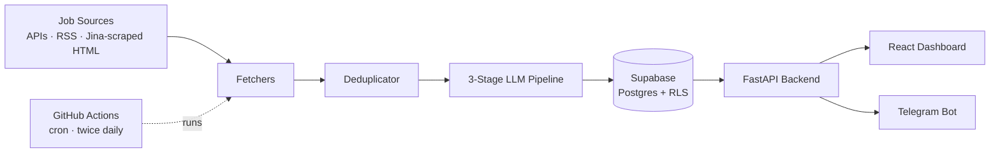

# JobPulse

**An AI-powered remote-job aggregator that scrapes multiple job sources, scores every role against your profile with a multi-stage LLM pipeline, and delivers your best matches to a web dashboard and Telegram — running entirely on free-tier infrastructure.**

[](https://jobpulse-sepia.vercel.app/)


> **Live demo:** https://jobpulse-sepia.vercel.app/

---

## The problem

Searching for remote roles means checking a dozen job boards, re-reading the same listings, and manually judging which ones actually fit. JobPulse automates the whole loop: it continuously pulls listings from multiple sources, removes duplicates, uses LLMs to extract structured data and score each job against *your* profile, and surfaces only the high-fit roles — on the web and pushed straight to Telegram.

## How it works



### The 3-stage AI pipeline

Each incoming job runs through a staged pipeline designed to be accurate **and** stay inside free-tier rate limits:

| Stage | Job | Model |
|-------|-----|-------|
| **1 — Extract** | Pull structured fields (title, company, remote policy, role type) from messy scraped text | Groq · LLaMA 3.1 8B |
| **2 — Classify** | Determine seniority and filter out mismatches | Groq · LLaMA 3.1 8B |
| **3 — Score** | Rank each job 0–100 against the user's profile | Groq · LLaMA 3.1 8B |
| **On-demand** | Generate a tailored cover letter | Google Gemini |

To survive strict free-tier limits (Gemini's 15 RPM, Groq's 6,000 TPM), the pipeline **batches up to 7–15 jobs into a single prompt**, tracks each job by an embedded `job_index`, and validates the LLM's JSON output with Pydantic — recovering automatically if the model skips or malforms an entry, so the pipeline never crashes mid-run.

## Features

- 🔍 **Multi-source aggregation** — pluggable fetchers for REST APIs, RSS feeds, and full HTML pages (via Jina Reader)
- 🧠 **AI match scoring** — every job scored 0–100 against your profile, with reasoning
- 🧹 **Deduplication** — the same role from multiple boards collapses into one entry
- 📄 **Résumé import** — upload a PDF and auto-populate your profile (PyMuPDF + Groq)
- ✍️ **AI cover-letter generation** — one click per job, powered by Gemini
- 📊 **Analytics dashboard** — match-score distribution, source health, and trends (Recharts)
- 🩺 **Source health tracking** — each source is scored on pass-rate so dead/low-quality boards are visible
- 🤖 **Telegram bot** — link your account and receive top matches as they're found
- ⏰ **Hands-off operation** — a GitHub Actions cron runs the whole pipeline twice a day, free

## Tech stack

| Layer | Tech |
|-------|------|
| **Frontend** | React 19, Vite, Tailwind CSS, React Router, Recharts, Supabase JS |
| **Backend** | FastAPI, Uvicorn, Pydantic, SlowAPI (rate limiting), PyMuPDF |
| **AI / LLM** | Groq (LLaMA 3.1/3.3), Google Gemini |
| **Data** | Supabase (Postgres + Row-Level Security + Auth) |
| **Scraping** | Jina Reader, BeautifulSoup, feedparser |
| **Bot** | python-telegram-bot |
| **Infra** | GitHub Actions (cron), Render (API), Vercel (frontend) |

## Engineering highlights

This was built to production-grade standards on a $0 budget:

- **Security-hardened API** — CORS locked to the frontend origin in production, request-size caps, SlowAPI rate limiting, a global exception handler that never leaks stack traces, and structured JSON logging. SHA-pinned GitHub Actions to immutable commits.
- **Resilient by design** — circuit breakers around flaky scrapers, exponential backoff on LLM rate-limit errors, and Pydantic validators that tolerate model inconsistencies instead of crashing.
- **Free-tier-native architecture** — batched-prompt design and careful model selection keep the entire system (scraping + 3-stage LLM scoring + hosting) within free quotas.
- **Clean separation** — independent `backend/`, `scheduler/`, and `frontend/` services that deploy separately.

## Project structure

```
jobpulse/
├── backend/        FastAPI app — REST API, auth, Telegram handlers
│   └── routes/     jobs · sources · profile · imports · telegram · applications
├── scheduler/      Standalone pipeline run by GitHub Actions cron
│   ├── fetchers/   API · RSS · Jina HTML scrapers
│   └── pipeline/   3-stage LLM scoring, resilience, safety, models
├── frontend/       React + Vite + Tailwind dashboard
├── supabase/       Postgres migrations + RLS policies
├── telegram_bot/   Standalone bot runner
└── docs/           PRD, security review, architecture notes
```

## Local setup

> Requires Python 3.12, Node 18+, and a Supabase project.

```bash
# 1. Database — run the migration in your Supabase SQL editor
supabase/migrations/001_initial_schema.sql

# 2. Backend
cd backend
cp .env.example .env        # fill in Supabase, Groq, Gemini, Telegram keys
pip install -r requirements.txt
uvicorn main:app --reload

# 3. Frontend
cd frontend
cp .env.example .env        # fill in Supabase URL + anon key, API URL
npm install
npm run dev
```

The scheduler runs automatically via GitHub Actions, or manually:

```bash
cd scheduler && pip install -r requirements.txt && python main.py
```

## Roadmap

- [ ] Automated job applications (Gemini-driven form fill)
- [ ] Expand to 30+ sources with a fully batched processing architecture
- [ ] Migrate to the `google-genai` SDK

## Documentation

Design and engineering docs live in [`/docs`](docs/):

- **[Product Requirements (PRD)](docs/PRD.md)** — full feature spec and rationale
- **[Security review](docs/SECURITY.md)** — threat model and the patches applied
- **[Architecture notes](docs/GEMINI.md)** — AI context and pipeline decisions
- **[Project history](docs/PROJECT_HISTORY.md)** — build log and key decisions

---

*Built by [Oluwafolajinmi Aboderin](https://github.com/JimiR3d) — full-stack & AI engineering.*
